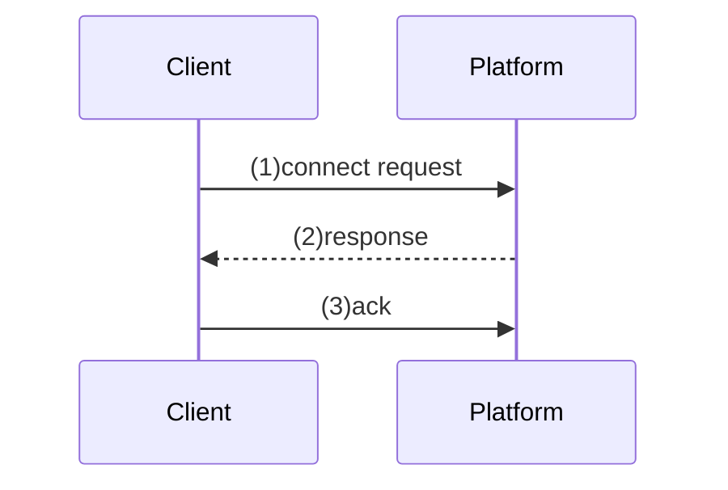
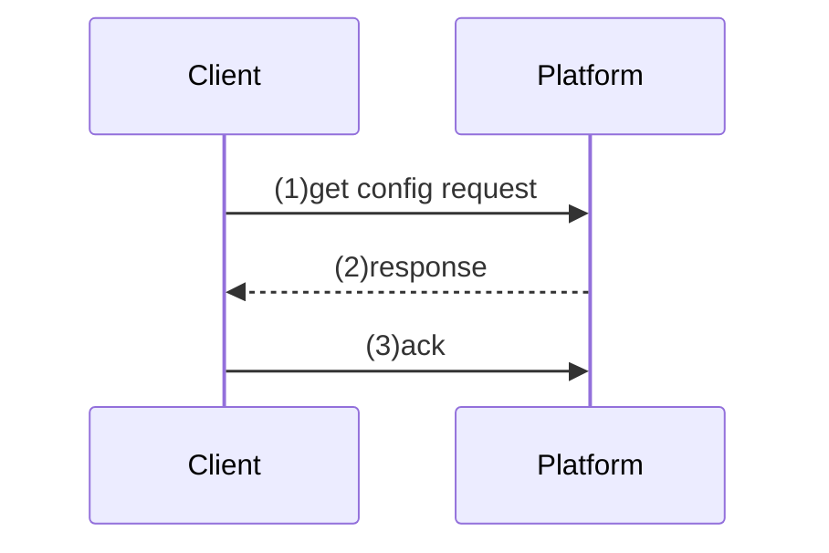
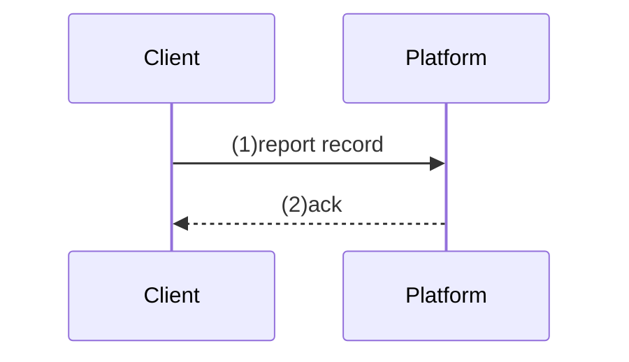
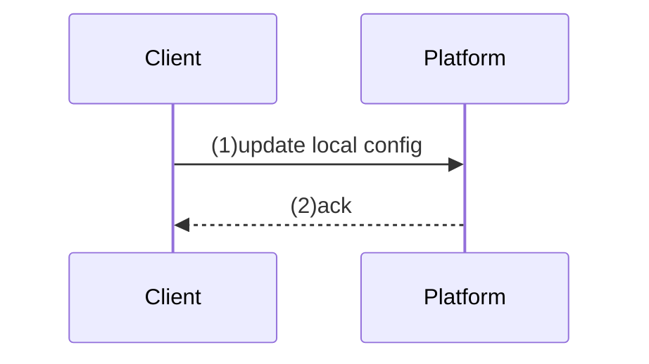
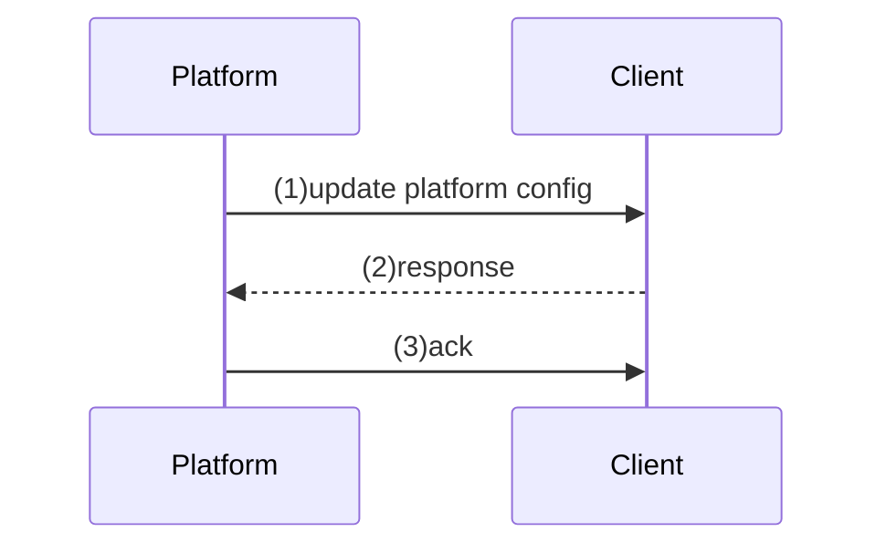

# 安检门设备消息对接文档
[TOC]

## 一、消息连接协议
使用MQTT在设备端与服务端进行消息通信。

### 连接信息

```
client.connect({
            userName: "string",
            password: "string"
        });
```

### 主题定义

当前设定一台安检门只需要订阅一个主题，所有的消息都从这个主题接收，并且只有一个主题用于推送消息。

参考 [主题设计规范](https://www.jianshu.com/p/fd8b379225fe)

- 用户订阅主题：securityDoor/sub/[设备SN码]
- 用户发布主题：securityDoor/pub/[设备SN码]

## 二、说明
### tx(Transaction)
```
平台有可能会在短时间内发起多次请求，这时tx用于保证每次请求的会话是同一个
tx需要确保全局唯一，在每个请求发起时生成，请求完成后失效
每条消息中都需要携带该信息
```

### 状态码定义
```
ACK: 收到消息确认，用于确保消息送达，实现消息重发机制
100: Trying，表示已经接收到了这个请求但是还没有执行，在之后应该返回执行的结果
            一般用于在一个请求执行需要耗时比较久的情况下返回，比如需要用户手动确认
200: OK，请求已经处理成功。 
400: Bad Request，请求中的语法错误。
401: Unauthorized，请求需要认证。
403: Forbidden，请求被拒绝执行，一般是没有权限
404: Not Found，请求的资源不存在
500: Server Internal Error，服务器遇到了未知的错误，并且无法处理请求。
```


## 三、消息内容格式

### 消息类型与格式规则

```
/module/action
{
	"tx":"uuid",
    "_comment":"不同类型消息可以有完全不同的字段"
}

```

- 消息路由：从第一个字符开始到第一个`{`之前为`消息路由`，类似http的路径，使用`/`分隔。
- 消息内容：从第一个`{`开始到最后一个`}`组成的内容为标准json数据，为实际消息数据

### 1.设备连接

#### a.路由   
/securityDoor/connect

#### b.设备上下线通知



```
/securityDoor/connect
{
    "status": 1/0	//标识 online/offline, 
    "connectTime": "2023-02-02 15:09:32",
    "model": "",
    "version": ""
}
```

#### c.设备异常断开通知
通过MQTT客户端设置willMessage"遗嘱消息"的方式实现

```
/securityDoor/connect
{
    "status": 0
}
```

### 2.安检门获取应用场景



```
/securityDoor/getScenario
{
	"scenario":"Metal",
	"config": {
		"sensitive": 10,
		"frequency": 10
	}
}
```

### 3.安检记录上报



```
/securityDoor/record
{
	"passStatus":"",   // 通过状态
	"passTime":"",     // 通过时间
	"passMode":"",     // 通过方式 IN/OUT
	"scenario":"",
	"alarmInfo": [{
        "area":"1",      // 区位
        "signal":"19",   // 信号量
        "suspectedItem":"手机"// 疑似物品
	},{
        "area":"2",      // 区位
        "signal":"5",   // 信号量
        "suspectedItem":"钥匙"// 疑似物品
	}]
}
```

### 4.安检门本地编辑配置信息



```
/securityDoor/updatedScenario
{
	"scenario":"Metal",
	"config": {
		"sensitive": 10,
		"frequency": 10
	}
}
```

### 5.平台编辑安检门配置



```
/securityDoor/updateScenario
{
	"scenario":"Metal",
	"config": {
		"sensitive": 10,
		"frequency": 10
	}
}
```

设置界面
1、系统配置
2、身份证配置
3、摄像头配置
4、检测调试界面（实时列表记录各区探测以及报警的数据，技术人员内部使用）
5、安装调试界面（每个区位的实时分区曲线，显示当前探测波形，可开放给客户）
6、系统升级 
7、设备自检 （身份证阅读器、摄像头、红外是否在线）
8、灵敏度设置界面（灵敏度相关参数）（二级密码）
